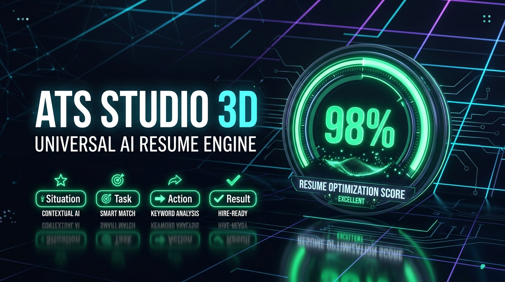

# ATS Studio 3D | Universal AI Resume Engine & Dynamic Optimizer

<p align="center">
  
</p>

<p align="center">
  <strong>Next-Generation Multi-Domain ATS Scoring, Google XYZ / STAR Bullet Point AI Optimization & Interactive 3D Resume Studio.</strong>
</p>

<p align="center">
  <a href="https://arjunn-git.github.io/resume_maker/"></a>
  
  
  
  
  
</p>

---

## ⚡ Executive Summary

**ATS Studio 3D** is an enterprise-grade resume optimization platform and interactive document builder engineered to maximize interview callback rates across Fortune 500 Applicant Tracking Systems (Workday, Greenhouse, Lever, Taleo, iCIMS).

Unlike traditional generic resume builders that export rigid multi-column layouts prone to ATS parse errors, **ATS Studio 3D** pairs a **deep 4-pillar mathematical scoring engine** with **automated STAR / Google XYZ formula bullet point rewriting** and **100% parseable single-column typography**.

All core resume processing, text extraction, scoring, and PDF compilation execute **entirely client-side in browser memory**, guaranteeing **absolute data privacy and zero server logging**.

---

## 🔒 Enterprise Privacy & Security Guarantee

Data privacy is the foundational pillar of ATS Studio 3D:

* **100% Client-Side In-Browser Execution**: Uploaded PDF and TXT resumes are parsed locally using Mozilla's spatial [PDF.js](https://mozilla.github.io/pdf.js/) engine.
* **Zero Third-Party Storage**: Resume text, contact information, work experience, and personal data are never sent to external tracking servers, cloud databases, or third-party advertising networks.
* **Zero Telemetry or Analytics Scraping**: No invasive tracker pixels, fingerprinting scripts, or session recordings.
* **Transient Memory Model**: All session adjustments reside strictly within the user's active browser session memory and can be cleared instantaneously.

---

## 🌟 Key Capabilities

### 1. Universal 4-Pillar ATS Diagnostic Scoring (0–100%)
Evaluates resumes across four critical screening criteria:
* **Keywords & Domain Competency (0–25)**: Evaluates high-yield technical and domain skill density matched against 15+ industry taxonomies.
* **Impact & Quantifiable Metrics (0–25)**: Detects measurable KPIs, percentage increases, revenue contributions, and cost reductions.
* **Structural Completeness (0–25)**: Validates required ATS sections (Summary, Experience, Education, Skills, Contact Info).
* **Readability & ATS Safety (0–25)**: Assesses bullet point structure, single-column parsing stability, and action power verb distribution.

### 2. STAR / Google XYZ Formula AI Bullet Point Engine
* Automatically transforms passive job duty lists into executive-level impact statements:
  $$Accomplished [X], as measured by [Y], by doing [Z]$$
* One-click suggestions to inject industry power verbs and quantifiable metric templates.

### 3. Real-Time Dynamic In-App Resume Studio
* Split-pane interactive builder: edit text on the left while watching the ATS score and document preview recalculate dynamically on every keystroke.
* Multi-template switcher: *Modern ATS*, *Classic Executive*, *Clean Minimal*, and *One-Page Compact*.
* Multi-palette themes: Royal Blue, Charcoal Minimal, Deep Indigo, Emerald Green, and Crimson Executive.

### 4. 1-Click Job Match & Keyword Tailoring
* Paste any job posting description to instantly calculate your compatibility score.
* Automatically identifies missing hard skills, keywords, and qualifications with a 1-click option to append missing competencies directly into your resume profile.

### 5. Watermark-Free Direct Export
* Client-side PDF export free of extraneous headers, footers, URLs, tracking IDs, or platform watermarks.
* Direct Word (`.doc`) generation retaining standard clean semantic headings.

---

## 🛠️ Architecture & Technology Stack

| Layer | Technologies | Purpose |
| :--- | :--- | :--- |
| **Frontend UI** | React 18.2, JavaScript (ES6+) | Reactive state, component modularity, client-side lifecycle management |
| **Styling & Design** | Tailwind CSS 3.4, PostCSS, Autoprefixer | Dual-mode styling (Dark & Luminous Light), fluid typography, responsive layout |
| **3D & Canvas** | HTML5 Canvas 2D API, Custom CSS Keyframes | Depth particle constellation, mouse-tracking perspective tilt, laser scan animations |
| **Document Processing** | Mozilla PDF.js (`pdfjs-dist`), html2pdf.js, jsPDF | Spatial coordinate text extraction, client-side PDF parsing & compilation |
| **Iconography & Polish** | Lucide React, Canvas Confetti | Modern vector iconography, celebratory achievement micro-interactions |
| **Build & Tooling** | Vite 5.4, Rollup | Lightning-fast development server, tree-shaking, production asset bundling |
| **Optional Microservice** | Node.js, Express 4.18, Helmet, CORS, Joi | Hybrid backend fallback for server-side evaluation and rate-limited API access |
| **CI/CD & Hosting** | GitHub Actions (`deploy-pages@v4`), GitHub Pages CDN | Automated workflow builds on `ubuntu-latest` and worldwide CDN static distribution |

---

## 📂 Project Organization

```text
resume_maker/
├── .github/
│   └── workflows/
│       └── deploy-gh-pages.yml    # Automated GitHub Pages CI/CD pipeline
├── public/
│   ├── favicon.svg               # Vector glowing cyber spark favicon
│   ├── og-image.jpg              # High-resolution social share preview banner
│   ├── robots.txt                # Search engine crawler directives
│   └── sitemap.xml               # XML sitemap for search indexing
├── src/
│   ├── components/
│   │   ├── 3d/
│   │   │   ├── AtsGauge3D.jsx     # Layered 3D circular score meter & boost delta
│   │   │   ├── Background3D.jsx   # Interactive 3D particle constellation canvas
│   │   │   ├── LaserScanner3D.jsx # Holographic laser scanning sweep overlay
│   │   │   └── TiltCard3D.jsx     # Mouse-tracking 3D perspective tilt wrapper
│   │   ├── AtsAuditPanel.jsx     # Diagnostic blocker, warning, and tip filters
│   │   ├── Dashboard.jsx         # Executive analytics overview
│   │   ├── Header.jsx            # Responsive navigation & dark/light theme switch
│   │   ├── JobMatch.jsx          # Job description matcher & keyword gap analyzer
│   │   ├── ResumeEditor.jsx      # Multi-section editor with inline AI rewrite tools
│   │   ├── ResumePreview.jsx     # Real-time document viewer & PDF print pipeline
│   │   ├── SeoContentSection.jsx # FAQ accordion, domain matrix & knowledge hub
│   │   └── Upload.jsx            # Drag-and-drop dropzone & multi-domain presets
│   ├── data/                     # Domain taxonomies & sample presets
│   ├── utils/
│   │   ├── analysis.js           # 4-pillar scoring algorithms & STAR rewriter
│   │   ├── api.js                # Environment-aware API resolution
│   │   └── theme.js              # Class-based theme management & persistence
│   ├── App.jsx                   # Root application controller
│   ├── index.css                 # Custom scrollbars, glassmorphism & print rules
│   └── main.jsx                  # React application entry point
├── index.html                    # SEO metadata, Open Graph, Twitter cards & JSON-LD
├── tailwind.config.cjs           # Class-based dark mode & Tailwind extensions
├── vite.config.js                # Vite base configuration & plugins
└── package.json                  # Frontend dependencies & build scripts
```

---

## 🚀 Quick Start & Local Development

### Prerequisites
* **Node.js**: v18.0.0 or higher
* **npm**: v9.0.0 or higher

### 1. Clone the Repository
```bash
git clone https://github.com/arjunn-git/resume_maker.git
cd resume_maker
```

### 2. Install Dependencies
```bash
npm install
```

### 3. Launch Local Development Server
```bash
npm run dev
```
Open [http://localhost:5173/resume_maker/](http://localhost:5173/resume_maker/) in your browser. The development server supports Hot Module Replacement (HMR).

### 4. Build for Production
```bash
npm run build
```
Compiled production-ready assets will be generated in the `dist/` directory.

---

## 🌐 Deployment & Continuous Delivery

The repository is pre-configured with a zero-downtime GitHub Actions workflow (`.github/workflows/deploy-gh-pages.yml`):

1. **Trigger**: Any push to the `main` branch automatically triggers the pipeline.
2. **Environment**: Runs on `ubuntu-latest` with Node.js 20.
3. **Build Step**: Executes `npm ci` followed by `npm run build`.
4. **Deploy**: Uploads the production artifact and deploys directly to GitHub Pages.

---

## 📄 License

Distributed under the **MIT License**. See the `LICENSE` file for further details.
